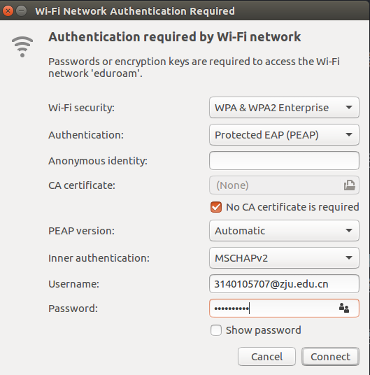

# 网络连接相关问题

## 安装XX-Net

### Environment
1. ubuntu 16.04
2. XX-net
3. privoxy

### Install

- 安装privoxy

```bash
sudo apt-get install privoxy
```

- 安装XX-net

直接访问项目主页[XX-net](https://github.com/XX-net/XX-Net)，内有安装说明

- 设置privoxy
在/etc/privoxy/config文件中加入

```bash
forward / 127.0.0.1:8087
listen-address 0.0.0.0:8118
```

### Usages

- 可以在访问时设置代理

```bash
curl ipinfo.io/ip --proxy 127.0.0.1:8087
```

- 也可以在.bashrc设置，这样所有的终端的网络访问都会走终端，在~/.bashrc文件中加入

```bash
export https_proxy=127.0.0.1:8087
export http_proxy=127.0.0.1:8087
```

然后

```bash
source ~/.bashrc
curl ipinfo.io/ip #测试是否代理成功
```

### Notes

3.10 15:36 chrome 在升级xxnet后成功翻墙了，而Firefox不行了。未升级前情况是相反的，但未升级时Firefox从不能用到能用。

## 有线连不上

手动设置ip
IPv4 settings

Address: 10.71.115.59
Netmask: 24
Gateway: 10.71.115.254
DNS server: 10.10.0.21

```bash
sudo su
ifconfig enp0s31f6 up
ifconfig enp0s31f6 10.71.115.59 netmask 255.255.255.0 up
ping 10.71.115.254
route add default gw 10.71.115.254 enp0s31f6
ping 10.71.45.100
```

## shadowssocks安装
### 二维码反解
对
```
ss://bWV0aG9kOnBhc3N3b3JkQGhvc3RuYW1lOnBvcnQ=
```

中的
```
bWV0aG9kOnBhc3N3b3JkQGhvc3RuYW1lOnBvcnQ=
```

base64解密得到

```
method:password@hostname:port
```


然后
```
sslocal -p port -k password -m method
```

[http://blog.csdn.net/qq_25978793/article/details/49870501](http://blog.csdn.net/qq_25978793/article/details/49870501)


### 系统代理与浏览器代理

无需单独设置系统代理，浏览器是可以通过插件设置代理的。

另外使用如curl需要代理时，可以采用
```
curl ip.cn --proxy socks5://127.0.0.1:1080
```

## 代理方案

- 只需要浏览器：shadowssocks + switchOmega
- 全局代理：shadowssocks + privoxy

参考 [Ubuntu配置Shadowsocks全局代理](https://xingjian.space/Computer-Network/global-proxy-of-Shadowsocks-in-Ubuntu/)

## CDN折腾记录

突然想到要怎么设置子域名，一开始还以为需要再次购买，原来并非如此，只需要添加解析即可。具体设置子域名和添加解析的方法可以参考github提供的帮助文档。

花了几个小时折腾完这个，突然又想实现https 访问，直接百度“github pages https”便有几篇文档，都谈到了cloudflare，注册之后可以享受免费版本的CDN服务。一开始我也不清楚CDN到底是什么，就直接按照网上的教程走

```
1. 注册cloudflare
2. 添加自己的网站
3. 将DNS服务器改为cloudflare上要求的，比如在阿里云的域名管理界面，将万网服务器换掉。
```

设置完这些之后，我也清楚可能不会理解生效，但也想尽快看看效果怎么样，于是搜索“更新dns缓存”的资料，尽管按照教程走了一遍，但是dns还是没有更新过来，通过
```
dig hohoweiya.xyz +noall +answer
```
返回的结果仍然为未添加cloudflare时的信息。同时访问hohoweiya.xyz并没有传说中的https出现，又郁闷了很久。

在某一刻，突然发现在firefox浏览器中访问时自动跳转到了https，然而在chrome中依然为http，然后我强制在地址栏中加入https，打开开发者模式，说有混合的错误，调用了http的资源，于是我又便去改了网站的资源地址，将http的资源改为https的。直到某一刻才清醒过来，原来我的firefox开了自动代理，之所以能够用https访问是因为我是通过代理访问的，去掉代理后，在Firefox中也是http，即使强行添加https也会报warning。

后来，觉得可能是校园网的原因，导致dns还没有更新过来，于是在服务器上ping了域名地址，已经显示为cloudflare提供的ip了。此时，也通过了www.ping.chinaz.com 进行了测试，表明cloudflare已经添加成功了，只是本地迟迟不能够访问。

并且，通过手机也是能够通过https访问的，于是我做了一个试验，开启手机的热点，让电脑通过手机上网，这时候无论是ping还是dig都返回出了cloudflare的ip，而且此时访问hohoweiya.xyz已经自动为https了。

到现在，原因已经很显然了，因为校园网是通过电信的，不同运营商更新dns的时间可能存在差异，导致一开始在校园网上访问网址不能通过https，以及ping和dig的结果没有发生变化。

折腾了一晚上，也算是了解了一点点cdn和dns的知识吧，知识有时候不要太固执，该等待的时候还是要耐心一点。

## Ubuntu连接UWS和eduroam

默认情况下一直连接不是，注意选对security，Authentication应当选择PEAP，如图。




## 阿里公共ADS差评

之前轻信了阿里公共ADS，在Ubuntu上装了，链接在[此](http://www.alidns.com/setup/#linux)，然而却无法取消设置，restore选项毫无作用。也一直不管它，在枫叶国，竟然连google都ping不通，这就很奇怪了，于是便怀疑是它搞的鬼。

为了彻底根除这个毒瘤，
```
cd /etc/resolvconf/resolv.conf.d/
sudo vim head
## 删除文件中的所有信息，其实只有阿里公共ads的配置信息
sudo vim head.save
## 删除文件中的所有信息，其实只有阿里公共ads的配置信息
```

终于好了！

## rvpn

Ubuntu下配置rvpn，需要浏览器启用JAVA插件，但新版本的chrome和firefox都不支持（firefox 52以后都不行了），解决办法是安装一个旧版本的firefox，然后按照登录rvpn时的说明进行配置就ok了。

## proxychains实现命令行代理

参考[How to use SOCKS 5 proxy in Ubuntu command line](https://bokunokeiken.wordpress.com/2015/07/22/how-to-use-socks-5-proxy-in-ubuntu-command-line/)

```
proxychains curl ip.cn
```

## hosts文件原理

有段时间是采用更改hosts文件来访问谷歌，但其背后的原理一直不甚清楚。突然想到这个问题，看了下面的两个博客，大致明白了。

简单来说，其目的跟dns解析域名一样，但是优先级更高，如果本机hosts文件中已经有了某域名的ip映射，则不需要通过dns返回域名ip。

更多细节可以参考这两个博客

1. [host文件的工作原理及应用](http://blog.csdn.net/tskyfree/article/details/41214829)
2. [简单科普下hosts文件原理与制作 | 老D博客](https://laod.cn/hosts/hosts-file-making.html)

## 玉泉 Ubuntu 连接 VPN

黄熊的[浙大玉泉ubuntu有线上网](http://wwtalwtaw.studio/2018/04/26/net_surfing/)讲得很详细。不过我却碰到个很奇怪的问题，申请完静态 IP，能够 ping 通内网，但当我安装完 `xl2tpd_zju` 后，却总是一直连不上网，更奇怪的是，还不能访问内网（没有运行 `vpn-connect` 前至少可以访问内网）。然后我尝试了各种办法，包括但不限于：

1. 重装 `xl2tpd_zju`；
2. 换个 `xl2tpd_zju` 的版本，在 cc98 上有两个版本，下载链接 [xl2tpd_zju](https://pan.baidu.com/s/1eRNQwng#list/path=%2F)；
3. 修改 `/etc/network/interfaces`
4. 各种组合式操作

但都迷之不能联网。

遂准备换种方式，参考[Ubuntu16.04配置L2TP-VPN](http://keyun.ml/2016/07/17/Tools/ubuntu16-l2tp-vpn.html)

但这种安装最新版本，`libnma`的版本跟不上，然后参考[L2tp IPSEC PSK VPN client on (x)ubuntu 16.04](https://askubuntu.com/questions/789421/l2tp-ipsec-psk-vpn-client-on-xubuntu-16-04/797764)

直接用

```shell
sudo add-apt-repository ppa:nm-l2tp/network-manager-l2tp  
sudo apt-get update  
sudo apt-get install network-manager-l2tp
sudo apt-get install network-manager-l2tp-gnome
```

安装。

这种方式相当于增加了 `L2TP` VPN 的设置界面，到这里我也渐渐明白 `xl2tpd_zju` 和这种方式本质上应该是一样的。于是我按照之前的配置方式新建了一个 VPN 的连接，但还是没用。

最后我换了 VPN 的 ip（有两个 ip，10.5.1.5 和 10.5.1.9），之前 `xl2tpd_zju` 默认是 10.5.1.5，误打误撞，改成 10.5.1.9 后，竟然成功了！！

## CUHK VPN 连接失败

Ubuntu 16.04 

在安装 `network-manager-l2tp-gnome` 好后（如 https://medium.com/@hkdb/ubuntu-16-04-connecting-to-l2tp-over-ipsec-via-network-manager-204b5d475721），能够连接，但是并不能访问 google，甚至 baidu 也不行，而手机端 vpn 可以正常使用。并且尝试访问 google 失败后，便弹出 vpn stop 的消息。


## VPN 跳转

猜测可能由于墙的原因使得 VPN 不稳定，于是尝试在境外服务器连接 VPN

首先安装 

```bash
sudo add-apt-repository ppa:nm-l2tp/network-manager-l2tp
sudo apt-get install network-manager-l2tp
```

### 尝试一：通过 `-X` 在 GUI 中配置

参考 [setup L2TP IPsec VPN in archlinux using NetworkManager](https://gist.github.com/pastleo/aa3a9524664864c505d637b771d079c9)

打开配置窗口的命令为 [`nm-connection-editor`](https://askubuntu.com/questions/174381/openning-networkmanagers-edit-connections-window-from-terminal)，但竟然没有，原来没有装 

```bash
sudo apt-get install network-manager-gnome
```

### 尝试二：命令行添加

在尝试寻找 network manager 的 command line 命令时，发现好几个 `nmcli` 相关的命令，于是猜想应该是可以直接在 command line 中配置的，比如 [L2TP Connection Client on ubuntu 18.04 Server](https://askubuntu.com/questions/1167283/l2tp-connection-client-on-ubuntu-18-04-server)，但我先在本地测试有几个问题

- 似乎不需要 `connection.id`
- 需要指定 `ifname`

修改好之后，可以成功添加，但是准备连接时，报错

> NetworkManager fails with “Could not find source connection”

参考 [NetworkManager fails with “Could not find source connection”
](https://unix.stackexchange.com/questions/438224/networkmanager-fails-with-could-not-find-source-connection) 无果。后来在 [nmcli 的官方文档](https://developer.gnome.org/NetworkManager/stable/nmcli.html)中看到，似乎连接时需要指定 `ifname`，可用的 device 为

```bash
sudo nmcli device status 
```

但是再次连接依旧报错，不过错误跟我在墙内试图连接 VPN 时报错似乎一致。

> Error: Connection activation failed: the VPN service stopped unexpectedly.

### 尝试三：Windows

试用 Azure，申请了个 Windows 10，按照 ITSC 的指示连接 VPN，确实能够成功，但是连接成功后，我跟该电脑的连接也就断开了，再次尝试也连不上，只好重启。

## 内网穿透

系里的服务器需要内网才能访问，连接内网一般需要 VPN，但是因为墙的原因极其不稳定。可以考虑一种内网穿透的策略，借助一台境外有 public IP 的服务器（好几家的云服务商都提供了免费试用），将端口转发，详见 [shootback](https://github.com/aploium/shootback)


```bash
# ---- master ----
python3 master.py -m 0.0.0.0:10000 -c 0.0.0.0:10022 --ssl

# ---- slaver ----
# ps: the `--ssl` option is for slaver-master encryption, not for SSH
python(or python3) slaver.py -m 22.33.44.55:10000 -t 127.0.0.1:22 --ssl

# ---- YOU ----
ssh [username@]22.33.44.55 -p 10022
```

注意，`YOU` 的 username 是 slaver 的 username!!

另外一种更复杂的工具是 [frp](https://github.com/fatedier/frp)