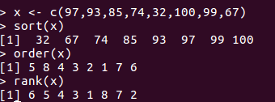
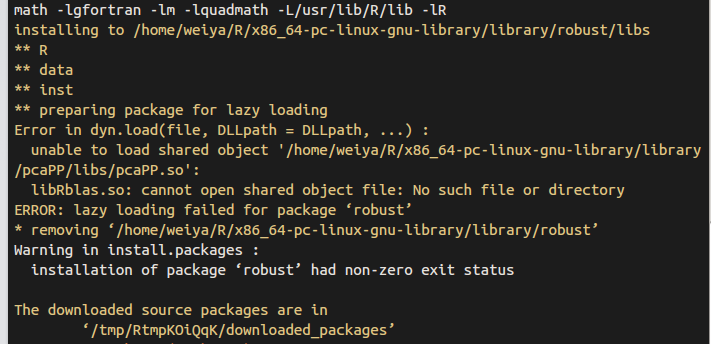
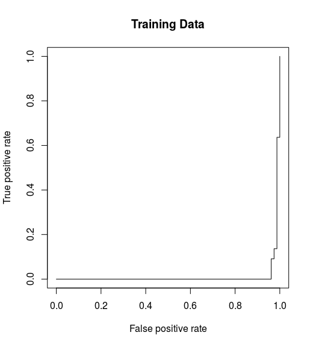

# R相关笔记

## 序列减去常数

```R
for (i in c(1:n-1))
  print(i)
##0
##1
##2
for (i in c(1:(n-1)))
  print(i)
##1
##2
```

## Error in plot.new() : figure margins too large in R

[reference](http://stackoverflow.com/questions/12766166/error-in-plot-new-figure-margins-too-large-in-r)


## linux更新的问题

查看[https://mirrors.tuna.tsinghua.edu.cn/CRAN/](https://mirrors.tuna.tsinghua.edu.cn/CRAN/) 中的README.md文件

### 更新记录
1. 找到源码文件夹

```r
sudo make uninstall
```

2. 配置source.list，安装。

## 终端执行R code

[reference](https://stackoverflow.com/questions/18306362/run-r-script-from-command-line)

```bash
touch main.R
vi main.R
### in main.R
##!/usr/bin/env Rscript
... ## R command
### save main.R
### run this file
./main.R
```

## shiny

[init](https://github.com/rstudio/shiny-server/issues/153)

## 删除

```bash
rm(list = ls(all = TRUE))
```

## interval

[http://blog.sciencenet.cn/blog-54276-288414.html](http://blog.sciencenet.cn/blog-54276-288414.html)

## window 安装包
切换到R的安装路径下，在etc文件夹中编辑文件Rprofile.site文件

```
## set a CRAN mirror
    local({r <- getOption("repos")
		r["CRAN"] <- "http://mirrors.ustc.edu.cn/CRAN/"
          options(repos=r)})
```

## sort(), rank(), order()

[http://blog.sina.com.cn/s/blog_6caea8bf0100spe9.html](http://blog.sina.com.cn/s/blog_6caea8bf0100spe9.html)

sort(x)是对向量x进行排序，返回值排序后的数值向量。rank()是求秩的函数，它的返回值是这个向量中对应元素的“排名”。而order()的返回值是对应“排名”的元素所在向量中的位置。



## Interpreting Residual and Null Deviance in GLM R


Refer to [https://stats.stackexchange.com/questions/108995/interpreting-residual-and-null-deviance-in-glm-r](https://stats.stackexchange.com/questions/108995/interpreting-residual-and-null-deviance-in-glm-r)

## 缺少libRblas.so和libRlapack.so的解决办法



虽然缺少libRblas.so和libRlapack.so，但却有libblas.so和liblapack.so，而它们应该是一样的，只是文件名不同而已，为此添加链接即可。

```bash
cd /usr/lib
ln -s libblas.so libRblas.so
ln -s /usr/lib/R/module/lapack.so libRlapack.so
```

参考：
1. [https://bugs.launchpad.net/ubuntu/+source/rkward/+bug/264436](https://bugs.launchpad.net/ubuntu/+source/rkward/+bug/264436)
2. [http://promberger.info/linux/2009/03/20/r-lme4-matrix-not-finding-librlapackso/](http://promberger.info/linux/2009/03/20/r-lme4-matrix-not-finding-librlapackso/)

## RSQLite

参考博文[https://statr.me/2011/10/large-regression/](https://statr.me/2011/10/large-regression/)

代码见[sqlite_ex.R](sqlite_ex.R)

## Rcpp


手动设置

```bash
cd /usr/local lib
##cd /usr/lib
ln -s /home/weiya/R/x86_64-pc-linux-gnu-library/library/Rcpp/libs/Rcpp.so libRcpp.so
```

## function 'dataptr' not provided by package 'Rcpp'

原因是因为没有在

```r
dyn.load()
```
前面添加

```r
library(Rcpp)
## 或require(Rcpp)
```

## R check package about description

check locale

## par cheatsheet

[r-graphical-parameters-cheatsheet](r-graphical-parameters-cheatsheet.pdf)

## Mathematical Annotation in R plot

```r
plot(..., main = expression(paste("...", mu[1])))
```

参考
1. [Mathematical Annotation in R
](http://vis.supstat.com/2013/04/mathematical-annotation-in-r/)

## Problems installing the devtools package

[关于curl](https://stackoverflow.com/questions/20923209/problems-installing-the-devtools-package)


## function 'dataptr' not provided by package 'Rcpp'

参考[function 'dataptr' not provided by package 'Rcpp'](https://stackoverflow.com/questions/21657575/what-does-this-mean-in-lme4-function-dataptr-not-provided-by-package-rcpp)


## Rcpp reference

[Rcpp-quickref](Rcpp-quickref.pdf)

## remove outliers from the boxplot

[How to remove outliers from a dataset
](https://stackoverflow.com/questions/4787332/how-to-remove-outliers-from-a-dataset)

## rmarkdown转化中文字符为PDF的设置

```r
---
title: "test"
author: "weiya"
output:
    pdf_document:
        latex_engine: xelatex
        includes:
            in_header: header.tex
---
```


## 在grid排列图

[Arranging plots in a grid](https://cran.r-project.org/web/packages/cowplot/vignettes/plot_grid.html)

## x11 font cannot be loaded

参考[X11 font -adobe-helvetica-%s-%s-*-*-%d-*-*-*-*-*-*-*, face 2 at size 11 could not be loaded](https://askubuntu.com/questions/449578/x11-font-adobe-helvetica-s-s-d-face-2-at-size-11-could-no)

## 安装多版本R
[Installing multiple versions of R](https://support.rstudio.com/hc/en-us/articles/215488098-Installing-multiple-versions-of-R)

## semi-transparency is not supported on this device

[semi-transparency is not supported on this device](http://tinyheero.github.io/2015/09/15/semi-transparency-r.html)

## MC, MCMC, Gibbs采样 原理

[MC, MCMC, Gibbs采样 原理&实现（in R）](http://blog.csdn.net/abcjennifer/article/details/25908495)

[](http://blog.csdn.net/abcjennifer/article/details/25908495)

[贝叶斯集锦（3）：从MC、MC到MCMC](https://site.douban.com/182577/widget/notes/10567181/note/292072927/)

[随机采样方法整理与讲解（MCMC、Gibbs Sampling等）](http://www.cnblogs.com/xbinworld/p/4266146.html)

[简单易学的机器学习算法——马尔可夫链蒙特卡罗方法MCMC](http://blog.csdn.net/google19890102/article/details/51755242)

[DP: Collapsed Gibbs Sampling](https://cs.stanford.edu/~ppasupat/a9online/1084.html)

[Metropolis Hasting算法](http://blog.csdn.net/flyingworm_eley/article/details/6517851)


## Running R in batch mode on Linux

[Running R in batch mode on Linux](http://www.cureffi.org/2014/01/15/running-r-batch-mode-linux/)

## RStudio: Warning message: Setting LC_CTYPE failed, using "C" 浅析

[RStudio: Warning message: Setting LC_CTYPE failed, using "C" 浅析](http://blog.csdn.net/wireless_com/article/details/51113668)

## “Kernel density estimation” is a convolution of what?

[“Kernel density estimation” is a convolution of what?](https://stats.stackexchange.com/questions/73623/kernel-density-estimation-is-a-convolution-of-what)

## unable to start rstudio in centos getting error “unable to connect to service”

[unable to start rstudio in centos getting error “unable to connect to service”
](https://stackoverflow.com/questions/24665599/unable-to-start-rstudio-in-centos-getting-error-unable-to-connect-to-service)

## 发布R包

[Releasing a package](http://r-pkgs.had.co.nz/release.html)

## Presentations with Slidy

[Presentations with Slidy
](http://rmarkdown.rstudio.com/slidy_presentation_format.html)

## Estimation of the expected prediction error

[Estimation of the expected prediction error](http://www.math.ku.dk/~richard/courses/regression2014/DataSplit.html)


## 协方差矩阵的几何解释

参考[协方差矩阵的几何解释](http://www.cnblogs.com/nsnow/p/4758202.html)

## ROCR包中prediction函数

`prediction`定义如下

```r
prediction(predictions, labels, label.ordering = NULL)
```

在绘制ROC曲线时，必要时需要指定`label.ordering`中negative和positive，否则结果会完全相反。举个例子

```r
## generate some data with a non-linar class boundary
set.seed(123)
x = matrix(rnorm(200*2), ncol = 2)
x[1:100, ] = x[1:100, ] + 2
x[101:150, ] = x[101:150, ] - 2
y = c(rep(1, 150), rep(2, 50))
dat = data.frame(x = x, y = as.factor(y))
plot(x, col = y)

## randomly split into training and testing groups
train = sample(200, 100)

## training data using radial kernel
svmfit = svm(y~., data = dat[train, ], kernel = "radial", cost = 1)
plot(svmfit, dat[train, ])

## cross-validation 
set.seed(123)
tune.out = tune(svm, y~., data = dat[train, ], kernel = "radial",
                ranges = list(cost = c(0.1, 1, 10, 100, 1000),
                              gamma = c(0.5, 1, 2, 3, 4)))
summary(tune.out)

## prediction
table(true = dat[-train, "y"], pred = predict(tune.out$best.model, newdata = dat[-train, ]))

## ROC curves
library(ROCR)
rocplot = function ( pred , truth , ...) {
  predob = prediction ( pred, truth , label.ordering = c("2", "1"))
  perf = performance ( predob , "tpr" , "fpr")
  plot ( perf,...) 
}
svmfit.opt = svm(y~., data = dat[train, ], kernel = "radial",
                 gamma = 3, cost = 10, decision.values = T)
fitted = attributes(predict(svmfit.opt, dat[train, ], decision.values = T))$decision.values

rocplot ( fitted , dat [ train ,"y"] , main ="Training Data")
```

对于上述代码，如果不指定`label.ordering = c("2", "1")`，则得到的ROC曲线如下图



原因是因为`fitted`与`y`大小关系相反，即前者大时后者小，而前者小时后者大。


