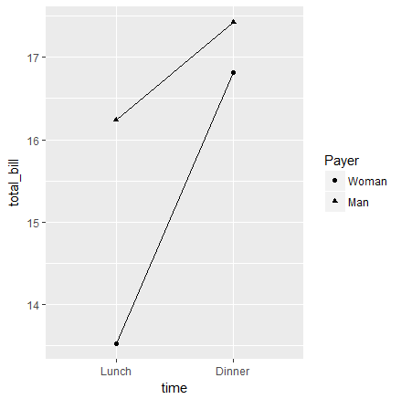
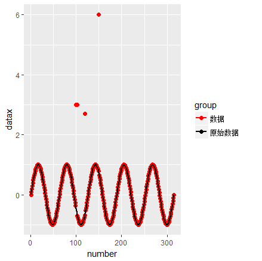
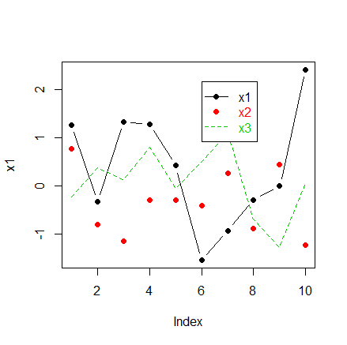
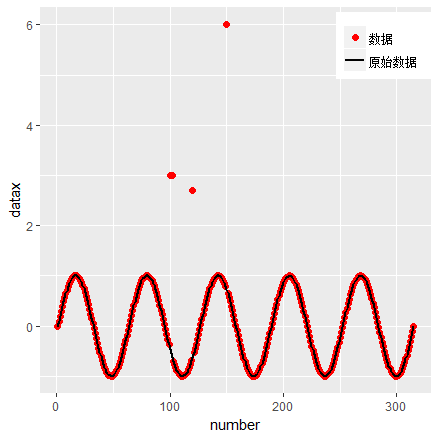
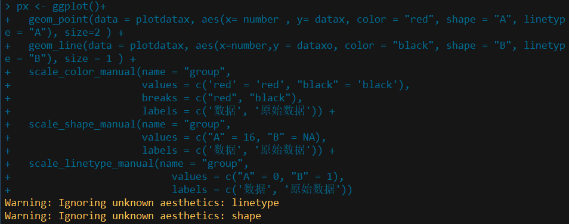
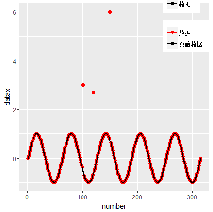

# ggplot中图例的使用（以某知乎问题为例）

在知乎上浏览到这样一个问题[R语言ggplot如何添加图例？ - 知乎](https://www.zhihu.com/question/267400251)，问题关键在于如何自定义满足下列条件的legend

1. 涉及两个数据集（虽然是同一个，但重复调用，相当于两个）
2. legend仅仅为点或线段（一般默认会同时显示点或线段）

## 普遍的情形

参考[Legends (ggplot2) | Cookbook for R](http://www.cookbook-r.com/Graphs/Legends_(ggplot2)/)这篇博文，应该可以解决一般情形下往ggplot中添加legends的问题。举个例子

```r
# A different data set
df1 <- data.frame(
    sex = factor(c("Female","Female","Male","Male")),
    time = factor(c("Lunch","Dinner","Lunch","Dinner"), levels=c("Lunch","Dinner")),
    total_bill = c(13.53, 16.81, 16.24, 17.42)
)

# A basic graph
lp <- ggplot(data=df1, aes(x=time, y=total_bill, group=sex, shape=sex)) + geom_line() + geom_point()
lp

# Change the legend
lp + scale_shape_discrete(name  ="Payer",
                          breaks=c("Female", "Male"),
                          labels=c("Woman", "Man"))
```



## 多个数据集

上述普遍的情形是涉及单一数据集，且类别标签已经存在数据集中，若多个数据集，数据集本身没有类别标签，但不同数据集表示不同类，则可以参考[R: Custom Legend for Multiple Layer ggplot | stackoverflow](https://stackoverflow.com/questions/18394391/r-custom-legend-for-multiple-layer-ggplot)。

```r
require(ggplot2)
x=seq(1,10,length=100)
data=data.frame(x,dnorm(x,mean=6.5,sd=1))
names(data)=c('x','new.data')
x.ribbon=seq(1,10,length=20)
ribbon=data.frame(x.ribbon,
                  dnorm(x.ribbon,mean=5,sd=1)+.01,
                  dnorm(x.ribbon,mean=5,sd=1)-.01,
                  dnorm(x.ribbon,mean=5,sd=1))
names(ribbon)=c('x.ribbon','max','min','avg')

ggplot()+#geom_ribbon(data=ribbon,aes(ymin=min,ymax=max,x=x.ribbon,fill='lightgreen'))+
  geom_line(data=ribbon,aes(x=x.ribbon,y=avg,color='black'))+
  geom_line(data=data,aes(x=x,y=new.data,color='red'))+
  xlab('x')+ylab('density') + 
  #scale_fill_identity(name = 'the fill', guide = 'legend',labels = c('m1')) +
  scale_colour_manual(name = 'the colour', 
                      values =c('black'='black','red'='red'), labels = c('c2','c1'))
```


## 单一shape或linetype

一开始对原知乎问题给出下面的解法

```r
px <- ggplot()+
  geom_point(data = plotdatax, aes(x= number , y= datax, color = "red"), size=2 ) +
  geom_line(data = plotdatax, aes(x=number,y = dataxo, color = "black"), size = 1 ) +
  scale_color_manual(name = "group",
                     values = c('red' = 'red', "black" = 'black'), 
                     breaks = c("red", "black"),
                     labels = c('数据', '原始数据')) 
```



但图例同时存在shape和linetype，对于普通的`plot`，可以用`NA`来使得point type或linetype不显示，具体可以参考[R plot: Displaying both point type and line type in legend | stackoverflow](https://stackoverflow.com/questions/37897984/r-plot-displaying-both-point-type-and-line-type-in-legend)。

```r
set.seed(0); x1 <- rnorm(10); x2 <- rnorm(10); x3 <- rnorm(10)
plot(x1, type = "b", pch = 19, lty = 1, col = 1,
     ylim = range(c(x1,x2,x3)))  ## both points and lines
points(x2, pch = 19, col = 2)  ## only points
lines(x3, lty = 2, col = 3)  ## only lines
legend(6, 0.9*max(c(x1,x2,x3)), legend = c("x1", "x2", "x3"),
       pch = c(19, 19, NA), lty = c(1, NA, 2),
       col = c(1,2,3), text.col = c(1,2,3))
```



受此启发，也尝试在ggplot中使用，尝试后发现，对于`shape`用`NA`可以不显示点的形状，而`linetype`要用`0`才能不显示线条。

```r
px <- ggplot()+
  geom_point(data = plotdatax, aes(x= number , y= datax, color = "red", shape = "A", linetype = "A"), size=2 ) +
  geom_line(data = plotdatax, aes(x=number,y = dataxo, color = "black", shape = "B", linetype = "B"), size = 1 ) +
  scale_color_manual(name = "group",
                     values = c('red' = 'red', "black" = 'black'), 
                     breaks = c("red", "black"),
                     labels = c('数据', '原始数据')) + 
  scale_shape_manual(name = "group",
                     values = c("A" = 16, "B" = NA), 
                     labels = c('数据', '原始数据')) + 
  scale_linetype_manual(name = "group",
                          values = c("A" = 0, "B" = 1), 
                          labels = c('数据', '原始数据'))

px + theme(legend.title=element_blank(),
           legend.position = c(0.9, 0.9))
```



虽然与题主要求相符，但其实上述代码会报warning，如下



原因是geom_point中的aes没有linetype参数；

而geom_line中的aes没有shape参数，但如果前者不对linetype进行赋值，后者不对shape进行赋值，则得到的图形会有两个图例块。



更简洁更准确的做法应该是先对这些点进行标签，然后设置每个标签的color, shape以及linetype，代码如下：

```r
plotdatax$group = ifelse(datax == dataxo, "c2", "c1")

px <- ggplot(plotdatax, aes(color = group, shape = group, linetype = group))+
  geom_point(aes(x= number , y= datax), size=2 ) +
  geom_line(aes(x=number,y = dataxo), size = 1 ) +
  scale_color_manual(name = "group",
                     values = c("c1" = 'red', "c2" = 'black'), 
                     labels = c('数据', '原始数据')) + 
  scale_shape_manual(name = "group",
                     values = c("c1" = 16, "c2" = NA), 
                     labels = c('数据', '原始数据')) + 
  scale_linetype_manual(name = "group",
                        values = c("c1" = 0, "c2" = 1), 
                        labels = c('数据', '原始数据'))

px + theme(legend.title=element_blank(),
           legend.position = c(0.9, 0.9))
```


不过这样黑线少掉了红色点，也就是认为那些不在直线上的点才是第二类的点。如果坚持题主的意思，则完全可以重新构造数据集，代码如下

```r
length <-length(datax)
x.matrix1 <- cbind(1:length, datax)
x.matrix2 <- cbind(1:length, dataxo)
x.matrix <- rbind(x.matrix1, x.matrix2)
colnames(x.matrix) <- c("number", "datax")
plotdatax <- as.data.frame(x.matrix)

plotdatax$group <- rep(c("c1", "c2"), each = length)

px <- ggplot(plotdatax, aes(x = number, y = datax, color = group, shape = group, linetype = group))+
  geom_point(size=2) +
  geom_line(size = 1) +
  scale_color_manual(name = "group",
                     values = c("c1" = 'red', "c2" = 'black'), 
                     labels = c('数据', '原始数据')) + 
  scale_shape_manual(name = "group",
                     values = c("c1" = 16, "c2" = NA), 
                     labels = c('数据', '原始数据')) + 
  scale_linetype_manual(name = "group",
                        values = c("c1" = 0, "c2" = 1), 
                        labels = c('数据', '原始数据'))

px + theme(legend.title=element_blank(),
           legend.position = c(0.9, 0.9))
```


## 参考网页

除上述明确给出的参考链接，还参考了下列网页

1. [scale_manual: Create your own discrete scale](https://rdrr.io/cran/ggplot2/man/scale_manual.html)
2. [add point and line layers with customized legends in ggplot2](https://stackoverflow.com/questions/26196606/add-point-and-line-layers-with-customized-legends-in-ggplot2)

## 其他

附上探索过程中用到的一个toy example

```r
# Sample data
df <- read.table(header=T, text='
                 cond xval yval
                 A    1  2.0
                 A    2  2.5
                 B    1  3.0
                 B    2  2.0
                 ')
library(ggplot2)

# Plot with standard lines and points
# group = cond tells it which points to connect with lines
ggplot(df, aes(x=xval, y=yval, group = cond)) +
  geom_line() +
  geom_point()

# Set overall shapes and line type
ggplot(df, aes(x=xval, y=yval, group = cond)) +
  geom_line(linetype="dashed",  # Dashed line
            size = 1.5) +       # Thicker line
  geom_point(shape = 0,         # Hollow squares
             size = 4)          # Large points

# Condition shapes and line type on variable cond
ggplot(df, aes(x=xval, y=yval, group = cond)) +
  geom_line(aes(linetype=cond), # Line type depends on cond
            size = 1.5) +       # Thicker line
  geom_point(aes(shape=cond),   # Shape depends on cond
             size = 4)          # Large points

# Same as previous, but also change the specific linetypes and
# shapes that are used
ggplot(df, aes(x=xval, y=yval, group = cond)) +
  geom_line(aes(linetype=cond), # Line type depends on cond
            size = 1.5) +       # Thicker line
  geom_point(aes(shape=cond),   # Shape depends on cond
             size = 4) +        # Large points
  scale_shape_manual(values=c(NA,5)) +                  # Change shapes
  scale_linetype_manual(values=c(1, 0)) # Change linetypes
```