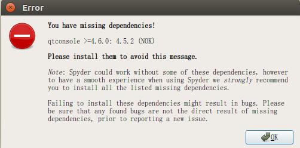
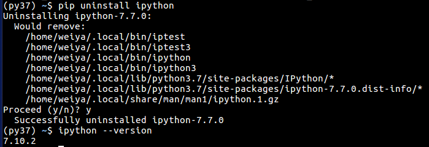

# python 相关

## 使用ipython %matplotlib inline

参考[cnblog](http://blog.csdn.net/u010194274/article/details/50698514)

使用%matplotlib命令可以将matplotlib的图表直接嵌入到Notebook之中，或者使用指定的界面库显示图表，它有一个参数指定matplotlib图表的显示方式。inline表示将图表嵌入到Notebook中

另外 `%` 的一般用法详见 [Built-in magic commands](https://ipython.readthedocs.io/en/stable/interactive/magics.html#)

## seaborn的使用

Matplotlib自动化程度非常高，但是，掌握如何设置系统以便获得一个吸引人的图是相当困难的事。为了控制matplotlib图表的外观，Seaborn模块自带许多定制的主题和高级的接口。
[segmentfault](https://segmentfault.com/a/1190000002789457)


## 远程访问jupyter
[远程访问jupyter](http://www.cnblogs.com/zhanglianbo/p/6109939.html)

## jupyter notebook 出错


可以通过
```
rm -r .pki
```
解决


## 创建jupyter notebook 权限问题


原因是所给的路径的用户权限不一致，jupyter的用户及用户组均为root，为解决这个问题，直接更改用户权限

```
sudo chown weiya jupyter/ -R
sudo chgrp weiya jupyter/ -R
```
其中-R表示递归调用，使得文件夹中所有内容的用户权限都进行更改。


## theano import出错


更改.theano文件夹的用户权限

## python 查看已安装的包

```
pip list
```

## conda更新spyder

```
(sudo proxychains) conda update spyder
```

## selenium

refer to [Selenium using Python - Geckodriver executable needs to be in PATH
](https://stackoverflow.com/questions/40208051/selenium-using-python-geckodriver-executable-needs-to-be-in-path)

## array operation

```
>>> a = np.sum([[0, 1.0], [0, 5.0]], axis=1)
>>> c = np.sum([[0, 1.0], [0, 5.0]], axis=1, keepdims=True)
>>> a/c
array([[ 1. ,  5. ],
       [ 0.2,  1. ]])
>>> a
array([ 1.,  5.])
>>> c
array([[ 1.],
       [ 5.]])
>>> d
array([[ 1,  5],
      [ 0, 10]])
>>> d/c
array([[ 1.,  5.],
      [ 0.,  2.]])
>>> d/a
array([[ 1.,  1.],
      [ 0.,  2.]])
```

## Difference between numpy.array shape (R, 1) and (R,)

refer to [Difference between numpy.array shape (R, 1) and (R,)](https://stackoverflow.com/questions/22053050/difference-between-numpy-array-shape-r-1-and-r)

## 正式认识conda

参考[https://conda.io/docs/user-guide/getting-started.html](https://conda.io/docs/user-guide/getting-started.html)

## 为 py3 安装 spyder

1. 先建一个conda环境bunny，安装python3.4，因为要支持pyside，而经试验3.5+不支持。
2. 安装cmake
3. pyside出现keyerrror

转向py3.6
不装pyside，而装pyqt5
```bash
pip install pyqt5
```

最终在新建的另一个 conda 环境 snakes 中装好了 Python3.6 及 spyder3，通过下面命令运行就 OK 了。

```bash
source activate snakes
spyder3 &
```

## xrange and range

基本都在循环时使用，输出结果也是一样的，但略有差异

- range 直接生成一个 list 对象
- xrange 返回一个生成器。性能会比 range 好，特别是很大的时候。

参考[Python中range和xrange的区别](http://blog.csdn.net/imzoer/article/details/8742283)

## 安装sqlite3

参考[Python安装sqlite3](http://www.python88.com/topic/420/)

## windows下安装lxml

参考[python安装lxml，在windows环境下](http://blog.csdn.net/g1apassz/article/details/46574963)

## 缺少Python27_d.lib

参考[缺少Python27_d.lib的解决方法](http://blog.csdn.net/junparadox/article/details/52704287)

## 远程访问Jupyter Notebook

[远程访问Jupyter Notebook](http://www.cnblogs.com/zhanglianbo/p/6109939.html)

## 人工鱼群算法-python实现

[人工鱼群算法-python实现](http://www.cnblogs.com/biaoyu/p/4857911.html)


## 请问phantom-proxy如何设置代理ip

[请问phantom-proxy如何设置代理ip](https://segmentfault.com/q/1010000000685938)

## python 编码介绍

[Python编码介绍——encode和decode](http://blog.chinaunix.net/uid-27838438-id-4227131.html)

## 爬虫必备requests

[爬虫必备——requests](https://zhuanlan.zhihu.com/p/20410446)

## Python使用代理抓取网站图片（多线程）

[Python使用代理抓取网站图片（多线程）](http://www.jb51.net/article/48112.htm)

## python中threading模块详解

[python中threading模块详解（一）](http://blog.chinaunix.net/uid-27571599-id-3484048.html)

## python 爬虫获取XiciDaili代理IP

[python 爬虫获取XiciDaili代理IP](http://30daydo.com/article/94)

## 使用SQLite

[使用SQLite](https://www.liaoxuefeng.com/wiki/001374738125095c955c1e6d8bb493182103fac9270762a000/001388320596292f925f46d56ef4c80a1c9d8e47e2d5711000)

[python 使用sqlite3](http://www.cnblogs.com/hongten/p/hongten_python_sqlite3.html)

[用Python进行SQLite数据库操作](http://www.cnblogs.com/yuxc/archive/2011/08/18/2143606.html)

[Python调用MongoDB使用心得](https://www.oschina.net/question/54100_27233)

## python urllib2详解及实例

[python urllib2详解及实例](http://www.pythontab.com/html/2014/pythonhexinbiancheng_1128/928.html)

## 使用Selenium

参考[Python爬虫入门实战七：使用Selenium--以QQ空间为例](https://www.jianshu.com/p/ffd02cc9d4ef)

## Python中将打印输出导向日志文件

参考[Python中将打印输出导向日志文件](https://www.cnblogs.com/arkenstone/p/5727883.html)


## python 中文编码

参考[python 中文编码(一)](https://www.cnblogs.com/tk091/p/4012004.html)

## Python爬虫利器二之Beautiful Soup的用法

参考[Python爬虫利器二之Beautiful Soup的用法](https://cuiqingcai.com/1319.html)

## 正则表达式之捕获组/非捕获组介绍

参考[正则表达式之捕获组/非捕获组介绍](http://www.jb51.net/article/28035.htm)

## python pip 采用国内镜像

在win10下设置，参考[Python pip 国内镜像大全及使用办法](http://blog.csdn.net/testcs_dn/article/details/54374849)

在用户文件夹下新建pip文件夹，里面新建pip.ini文件

```txt
[global]
index-url=http://mirrors.aliyun.com/pypi/simple/
[install]
trusted-host=mirrors.aliyun.com
```

注意编码格式为utf8无BOM。

## conda 在window下设置

win10下已经装了anaconda，spyder(2.7)，现想再装上python3，于是利用conda创建一个python3的环境`bunny`。

```cmd
conda create --name bunny python=3
```

切换到bunny环境

```cmd
activate bunny
```

参考[spyder3 doc](https://pythonhosted.org/spyder/installation.html)

```cmd
pip install spyder3
```

## 又拍云的短信平台

参考文献

1. [Python 使用requests发送POST请求 - CSDN博客](http://blog.csdn.net/junli_chen/article/details/53670887)
2. [Python-爬虫-requests库用语post登录](https://www.cnblogs.com/fredkeke/p/7000687.html)

## json与字符串

```python
payload='{'name': weiya}'
# payload='payload = {'name': weiya}'
```

换成json
```python
json.loads(payload)
```

!!! warning
    注意不能采用注释掉的部分。

## unquote %7B character

参考[transform-url-string-into-normal-string-in-python-20-to-space-etc](https://stackoverflow.com/questions/11768070/transform-url-string-into-normal-string-in-python-20-to-space-etc)

1. python2

```python
import urllib2
print urllib2.unquote("%CE%B1%CE%BB%20")
```

2. python3

```python
from urllib.parse import unquote
print(unquote("%CE%B1%CE%BB%20"))
```

## convert bytes to string

参考[convert-bytes-to-a-string](https://stackoverflow.com/questions/606191/convert-bytes-to-a-string)

```python
b"abcde".decode("utf-8")
```

## json.dumps() 和json.dump()的区别

简言之，`dumps()`和`loads()`都是针对字符串而言的，而`dump()`和`load()`是针对文件而言的。具体细节可疑参见[python json.dumps()  json.dump()的区别 - wswang - 博客园](https://www.cnblogs.com/wswang/p/5411826.html)

## 字符串前面添加u,r,b的含义

参考[python学习-字符串前面添加u,r,b的含义](http://www.cnblogs.com/cq90/p/6959567.html)

u/U:表示unicode字符串
不是仅仅是针对中文, 可以针对任何的字符串，代表是对字符串进行unicode编码。
一般英文字符在使用各种编码下, 基本都可以正常解析, 所以一般不带u；但是中文, 必须表明所需编码, 否则一旦编码转换就会出现乱码。
建议所有编码方式采用utf8

r/R:非转义的原始字符串
与普通字符相比，其他相对特殊的字符，其中可能包含转义字符，即那些，反斜杠加上对应字母，表示对应的特殊含义的，比如最常见的”\n”表示换行，”\t”表示Tab等。而如果是以r开头，那么说明后面的字符，都是普通的字符了，即如果是“\n”那么表示一个反斜杠字符，一个字母n，而不是表示换行了。
以r开头的字符，常用于正则表达式，对应着re模块。

b:bytes
python3.x里默认的str是(py2.x里的)unicode, bytes是(py2.x)的str, b”“前缀代表的就是bytes
python2.x里, b前缀没什么具体意义， 只是为了兼容python3.x的这种写法

## mdx_math安装命令

参考[manage-your-cms-using-mkdocs](http://wutongtree.github.io/devops/manage-your-cms-using-mkdocs)

```bash
sudo pip install python-markdown-math
```

## python 3 中的 str 和 bytes

参考[浅析Python3中的bytes和str类型 - Chown-Jane-Y - 博客园](https://www.cnblogs.com/chownjy/p/6625299.html)

这篇博文讲得很清楚

## flask 中 jsonify 和 json.dumps 的区别

参考[在flask中使用jsonify和json.dumps的区别](http://blog.csdn.net/Duke_Huan_of_Qi/article/details/76064225)

另外 flask 的入门文档见

[快速入门 &mdash; Flask 0.10.1 文档](http://docs.jinkan.org/docs/flask/quickstart.html#quickstart)

## with 语句

参考[Python with语句](https://www.cnblogs.com/zhangkaikai/p/6669750.html)

简言之，“使用with后不管with中的代码出现什么错误，都会进行对当前对象进行清理工作。”

这也就是为什么在用 MySQLdb 的时候，称“With the with keyword, the Python interpreter automatically releases the resources. It also provides error handling.” 详见[MySQL Python tutorial - programming MySQL in Python](http://zetcode.com/db/mysqlpython/)

## How can I use Conda to install MySQLdb?


参考[How can I use Conda to install MySQLdb?](https://stackoverflow.com/questions/34140472/how-can-i-use-conda-to-install-mysqldb)

## 远程连接 mysql

首先需要在服务器端，在`my.cnf` 中注释掉

```bash
# bind-address = 127.0.0.1
```

并且在 mysql 中创建用户并设置权限，如

```bash
create user 'test'@'%' identified by 'test123';
grant all privileges on testdb.* to 'test'@'%' with grant option;
```

参考

1. [Host 'xxx.xx.xxx.xxx' is not allowed to connect to this MySQL server](https://stackoverflow.com/questions/1559955/host-xxx-xx-xxx-xxx-is-not-allowed-to-connect-to-this-mysql-server)
2. [How to allow remote connection to mysql](https://stackoverflow.com/questions/14779104/how-to-allow-remote-connection-to-mysql)

## sphinx 相关

### __init__

[https://stackoverflow.com/questions/5599254/how-to-use-sphinxs-autodoc-to-document-a-classs-init-self-method](https://stackoverflow.com/questions/5599254/how-to-use-sphinxs-autodoc-to-document-a-classs-init-self-method)

## @staticmethod 和 @classmethod

参考

1. [Difference between @staticmethod and @classmethod in Python](https://www.pythoncentral.io/difference-between-staticmethod-and-classmethod-in-python/)

2. [The definitive guide on how to use static, class or abstract methods in Python](https://julien.danjou.info/guide-python-static-class-abstract-methods/)

## jupyter 导致 GitHub 语言比例过分倾斜的讨论

[LInguist is reporting my project as a Jupyter Notebook](https://github.com/github/linguist/issues/3316)

## Show matplotlib plots in Ubuntu (Windows subsystem for Linux)

参考
[Show matplotlib plots in Ubuntu (Windows subsystem for Linux)](https://stackoverflow.com/questions/43397162/show-matplotlib-plots-in-ubuntu-windows-subsystem-for-linux)

## matplotlib math symbols

```python
plt.xlabel(r"\lambda")
```

refer to [Writing mathematical expressions](https://matplotlib.org/users/mathtext.html)

## 写入 non-ascii 字符

```python
f = open("filename", "w")
write_str = u'''
some non ascii symbols
'''
f.write(write.str)
```

会报错

```
'ascii' codec can't encode character
```

参考 [Python: write a list with non-ASCII characters to a text file](https://stackoverflow.com/questions/33255846/python-write-a-list-with-non-ascii-characters-to-a-text-file) 采用 `codecs.open(, "w", encoding="utf-8")` 可以解决需求。

## 不同 environment 的 jupyter

其实不用对每个 environment 安装单独的 jupyter，只有安装好 ipykernel 就好，这样都能从 base environment 中通过 jupyter 来选择不同 kernel，详见 [Kernels for different environments](https://ipython.readthedocs.io/en/stable/install/kernel_install.html#kernels-for-different-environments)

### 安装 julia 的 kernel

```julia
> add IJulia
```


## 画图 xy 顺序

1. imshow 中的 [origin and extent](https://matplotlib.org/tutorials/intermediate/imshow_extent.html)

> Generally, for an array of shape (M, N), the first index runs along the vertical, the second index runs along the horizontal. The pixel centers are at integer positions ranging from 0 to N' = N - 1 horizontally and from 0 to M' = M - 1 vertically. origin determines how to the data is filled in the bounding box.

also refer to

[matplotlib: coordinates convention of image imshow incompatible with plot](https://stackoverflow.com/questions/37706005/matplotlib-coordinates-convention-of-image-imshow-incompatible-with-plot)

## arrays with different size

- nested list

```python
[[1,2,3],[1,2]]
```

- numpy

```python
numpy.array([[0,1,2,3], [2,3,4]], dtype=object)
```

refer to [How to make a multidimension numpy array with a varying row size?](https://stackoverflow.com/questions/3386259/how-to-make-a-multidimension-numpy-array-with-a-varying-row-size)

## find index of an item

```python
>>> [1, 1].index(1)
0
>>> [i for i, e in enumerate([1, 2, 1]) if e == 1]
[0, 2]
>>> g = (i for i, e in enumerate([1, 2, 1]) if e == 1)
>>> next(g)
0
>>> next(g)
2
```

refer to [Finding the index of an item given a list containing it in Python](https://stackoverflow.com/questions/176918/finding-the-index-of-an-item-given-a-list-containing-it-in-python)

## index a list with another list

```python
L = ['a', 'b', 'c', 'd', 'e', 'f', 'g', 'h']
Idx = [0, 3, 7]
T = [L[i] for i in Idx]
```

refer to [In Python, how do I index a list with another list?](https://stackoverflow.com/questions/1012185/in-python-how-do-i-index-a-list-with-another-list)

## getting indices of true

```python
>>> t = [False, False, False, False, True, True, False, True, False, False, False, False, False, False, False, False]
>>> [i for i, x in enumerate(t) if x]
[4, 5, 7]
```

refer to [Getting indices of True values in a boolean list](https://stackoverflow.com/questions/21448225/getting-indices-of-true-values-in-a-boolean-list)

## do noting

`pass`

## remove by index

`del`

refer to [How to remove an element from a list by index?](https://stackoverflow.com/questions/627435/how-to-remove-an-element-from-a-list-by-index)

## install python without root

use miniconda

refer to [How to install packages in Linux (CentOS) without root user with automatic dependency handling?](https://stackoverflow.com/questions/36651091/how-to-install-packages-in-linux-centos-without-root-user-with-automatic-depen)

## `class ClassName` vs `class ClassName(object)`

1. In python 2.x, when you inherit from "object" you class is a "new style" class; the non inheriting from "object" case creates an "old style" class.
2. In python 3.x, all classes are new style - no need to set the metaclass.

refer to [class ClassName versus class ClassName(object)](https://stackoverflow.com/questions/10043963/class-classname-versus-class-classnameobject)

## `nbconvert failed: validate() got an unexpected keyword argument 'relax_add_props'`

refer to [nbconvert failed: validate() got an unexpected keyword argument 'relax_add_props' #2901](https://github.com/jupyter/notebook/issues/2901)

其实我的版本是一致的，但可能由于我进入 Jupyter notebook 方式不一样。

- 一开始，直接从base 进入，然后选择 snakes 的 kernel，导出失败，错误原因如上
- 直接在 snakes 进入 Jupyter notebook，这样可以成功导出

## disable default `base`

```bash
conda config --set auto_activate_base false
```

refer to [How do I prevent Conda from activating the base environment by default?](https://stackoverflow.com/questions/54429210/how-do-i-prevent-conda-from-activating-the-base-environment-by-default)

## 进程和线程

参考 [一道面试题：说说进程和线程的区别](https://foofish.net/thread-and-process.html)

```python
# -*- coding: utf-8 -*-

# https://foofish.net/thread-and-process.html

import os

# 进程是资源（CPU、内存等）分配的基本单位，它是程序执行时的一个实例。
# 程序运行时系统就会创建一个进程，并为它分配资源，然后把该进程放入进程就绪队列，
# 进程调度器选中它的时候就会为它分配CPU时间，程序开始真正运行。

print("current process: %s start..." % os.getpid())
pid = os.fork()
if pid == 0:
    print('child process: %s, parent process: %s' % (os.getpid(), os.getppid()))
else:
    print('process %s create child process: %s' % (os.getpid(), pid) )
    
# fork函数会返回两次结果，因为操作系统会把当前进程的数据复制一遍，
# 然后程序就分两个进程继续运行后面的代码，fork分别在父进程和子进程中返回，
# 在子进程返回的值pid永远是0，在父进程返回的是子进程的进程id。
    

# 线程是程序执行时的最小单位，它是进程的一个执行流，
# 是CPU调度和分派的基本单位，一个进程可以由很多个线程组成，
# 线程间共享进程的所有资源，每个线程有自己的堆栈和局部变量。
```

## conda package 的版本号不匹配

在用 anaconda3 新建 py37 环境后，安装 spyder，但是运行时弹出



而用 `conda list | grep qtconsole` 检查发现

```bash
qtconsole                 4.6.0                      py_0
```

隐隐约约感觉是装了多个版本，想卸载掉错误的版本，但都没找到 qtconsole 怎么查看版本号。然后 Google 发现另外一个类似的问题，

[Getting wrong version of packages using Conda](https://stackoverflow.com/questions/55350956/getting-wrong-version-of-packages-using-conda)

于是我也去检查了 ipython 的版本，发现 

```bash
$ ipython --version
7.7.0
```

而

```bash
$ conda list | grep ipython
ipython                   7.10.2           py37h39e3cac_0
```

同样存在版本号不一致的问题。

所以按照评论的建议，用 

```bash
pip uninstall ipython
```

首先解决了 ipython 的版本号不一致的问题。



受此启发，用

```bash
pip uninstall qtconsole
```

解决了 qtconsole 的问题。

## Kite 使用体验

Copilot 一直 detect 不出 spyder，只有刚开始装的时候检测到了，但那时候也没有起作用。而 kite 本身一直在 spyder 右下角的状态栏中。


## remote ipython kernel

一直想玩 jupyter 的远程 ipython kernel 连接，这样可以减轻本机的压力。

这两篇介绍得很详细，但是最后设置 ssh 那一步总是报错，总是说无法连接。

- [Connecting Spyder IDE to a remote IPython kernel](https://medium.com/@halmubarak/connecting-spyder-ide-to-a-remote-ipython-kernel-25a322f2b2be)
- [How to connect your Spyder IDE to an external ipython kernel with SSH PuTTY tunnel](https://medium.com/@mazzine.r/how-to-connect-your-spyder-ide-to-an-external-ipython-kernel-with-ssh-putty-tunnel-e1c679e44154)

因为我是直接把 `id_rsa.pub` 文件当作 `.pem` 文件，但如果我换成密码登录后就成功了。

而如果[直接命令行操作](https://github.com/ipython/ipython/wiki/Cookbook:-Connecting-to-a-remote-kernel-via-ssh)，则就像正常 ssh 一样，也会成功。

所以中间的差异应该就是 `.pem` 与 `id_rsa.pub` 不等同。具体比较详见 [what is the difference between various keys in public key encryption](https://stackoverflow.com/questions/17670446/what-is-the-difference-between-various-keys-in-public-key-encryption)

## usage of `yield`

> We should use yield when we want to iterate over a sequence, but don’t want to store the entire sequence in memory.

More details refer to [When to use yield instead of return in Python?](https://www.geeksforgeeks.org/use-yield-keyword-instead-return-keyword-python/)