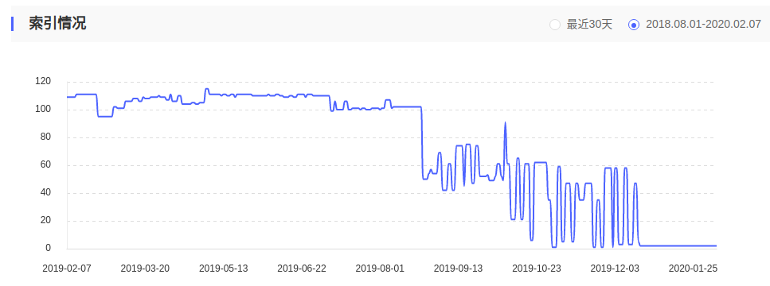
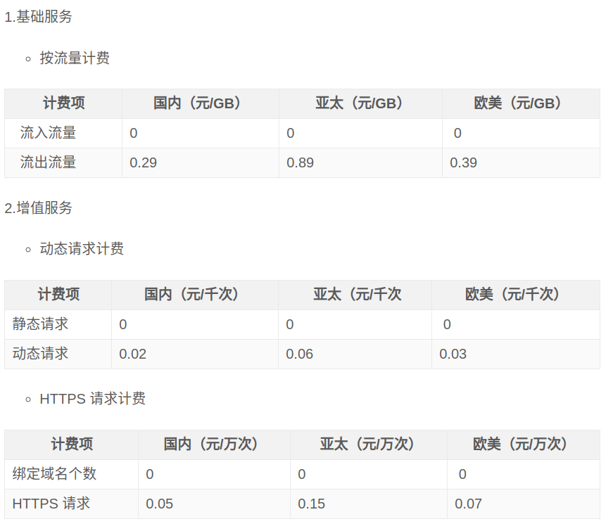
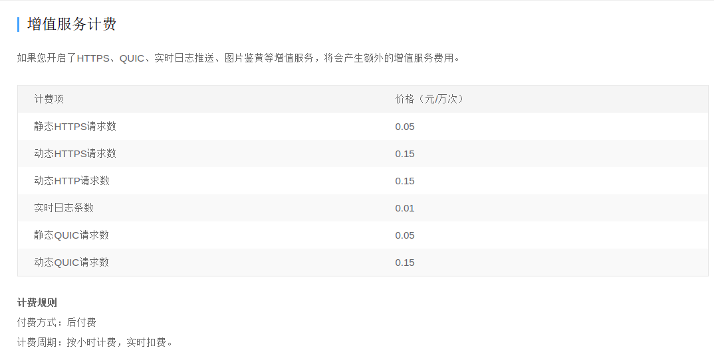

# 网站相关笔记

## 设置 Disqus

[https://sgeos.github.io/jekyll/disqus/2016/02/14/adding-disqus-to-a-jekyll-blog.html](https://sgeos.github.io/jekyll/disqus/2016/02/14/adding-disqus-to-a-jekyll-blog.html)

[迁移disqus讨论](https://help.disqus.com/customer/en/portal/articles/912627-domain-migration-tool)


disqus 迁移（待研究）

参考[Disqus 最近是不是被墙了啊？](https://www.v2ex.com/t/295213)

## mathjax中小于号与html的标签符号冲突

注意在mathjax中小于号左右空一格，不要连着写

## Github Pages 与百度爬虫

[解决 Github Pages 禁止百度爬虫的方法与可行性分析](http://jerryzou.com/posts/feasibility-of-allowing-baiduSpider-for-Github-Pages/)

[利用 CDN 解决百度爬虫被 Github Pages 拒绝的问题](https://www.dozer.cc/2015/06/github-pages-and-cdn.html)

### 索引量减少到几乎为 0 了



然后发现原来是忘记在百度专用服务器上 `git checkout gh-pages`了，导致直接访问失败，`git log` 显示，上一次更新时间还是 20190804，时间点差不多能对得上去。


## Jekyll Part 13: Creating an Article Series

[Jekyll Part 13: Creating an Article Series](https://digitaldrummerj.me/blogging-on-github-part-13-creating-an-article-series/)

## Add an "Updated" field to Jekyll posts

[Add an "Updated" field to Jekyll posts](https://zzz.buzz/2016/02/13/add-an-updated-field-to-your-jekyll-site/)

## iframe

[Embedding a document inside another using the "iframe" tag](http://www.javascriptkit.com/howto/externalhtml.shtml)

## Variable tags

[Variable tags](https://help.shopify.com/themes/liquid/tags/variable-tags#capture)


## Track Non-JavaScript Visits In Google Analytics

[Track Non-JavaScript Visits In Google Analytics](https://www.simoahava.com/analytics/track-non-javascript-visits-google-analytics/)

## Ubuntu 搭建Apache

参考[How To Install the Apache Web Server on Ubuntu 16.04](https://www.digitalocean.com/community/tutorials/how-to-install-the-apache-web-server-on-ubuntu-16-04)


[How To Install Linux, Apache, MySQL, PHP (LAMP) stack on Ubuntu 16.04](https://www.digitalocean.com/community/tutorials/how-to-install-linux-apache-mysql-php-lamp-stack-on-ubuntu-16-04)

自定义根目录注意设置权限。如

[Apache2: 'AH01630: client denied by server configuration'](https://stackoverflow.com/questions/18392741/apache2-ah01630-client-denied-by-server-configuration)

## Disqus国内访问

参考资料

1. [fooleap/disqus-php-api](https://github.com/fooleap/disqus-php-api)
1. [科学使用 Disqus](http://blog.fooleap.org/use-disqus-correctly.html)
1. [检测网络是否能够访问 Disqus](http://blog.fooleap.org/check-network-able-to-access-disqus.html)
1. [https://imququ.com/post/first-half-of-2016-blog-analytics.html#simple_thread](https://imququ.com/post/first-half-of-2016-blog-analytics.html#simple_thread)

2. [~~解决Hexo博客中 Disqus 在国内不能访问的方案~~](https://www.jianshu.com/p/9cc4cc8628c9)

### 服务器端配置过程

```bash
git clone git@github.com:fooleap/disqus-php-api.git
```

## 博客中插入网易云音乐

这个很容易实现，只需要在网易云中搜索要插入的音乐，然后点击“生成外链播放器”，将iframe代码插入博客的相应位置。

比如，我想在[不愿沉默如谜]()插入容祖儿的[重生](http://music.163.com/#/song?id=522631413)。点击页面中的“生成外链播放器”，将iframe代码放进原md文件中。但一开始有问题，iframe被当成普通的md文本。在[Jekyll raw HTML in post](https://stackoverflow.com/questions/30233461/jekyll-raw-html-in-post)中找到了答案。

网易云给的iframe代码为

```html
<iframe frameborder="no" border="0" marginwidth="0" marginheight="0" width=330 height=86 src="//music.163.com/outchain/player?type=2&id=522631413&auto=1&height=66"></iframe>
```

要将`width=330 height=86`改成`width="330" height="86"`，果然成功了。效果页面如下：

[](https://blog.hohoweiya.xyz/movie/2017/12/30/unwilling-to-be-silent.html)

## nginx虚拟主机配置

参考[How To Set Up Nginx Server Blocks (Virtual Hosts) on Ubuntu 14.04 LTS](https://www.digitalocean.com/community/tutorials/how-to-set-up-nginx-server-blocks-virtual-hosts-on-ubuntu-14-04-lts)

实现将本站用webhooks将其更新至阿里云服务器上，这与eslcn是同一个服务器，所以通过建立虚拟主机实现。


## jekyll中的相对路径

参考[Relative paths in Jekyll](https://ricostacruz.com/til/relative-paths-in-jekyll)

## URL 和 URI

参考[URL 和 URI 有什么不同? - 知乎](https://www.zhihu.com/question/19557151)

引用个人觉得简洁明了的回答

> URI (Identifier) 只讓你可以"區別"資源
> URL (Locator) 還讓你可以"找到"資源 (所以URL比一般的URI更"強", 是URI的子集)比如人的身份證號是 (非Locator的) Identifier: 不同身份證號一定是不同人, 但是用身份證號本身是找不到人的。这个人的住址或座标才是Locator。
> 
> 作者：艾征霸
> 链接：https://www.zhihu.com/question/19557151/answer/130049112
> 来源：知乎
> 著作权归作者所有。商业转载请联系作者获得授权，非商业转载请注明出处。

## nginx配置跳转

比如将所有 `http://ServerIP/10 Boosting and Additive Trees/.*` 的访问301重定向到`http://$server_name/10-Boosting-and-Additive-Trees/10.1-Boosting-Methods/index.html`，在nginx配置文件中添加
```cmd
location ^~ '/10 Boosting and Additive Trees/' {
        rewrite ^/.* http://$server_name/10-Boosting-and-Additive-Trees/10.1-Boosting-Methods/index.html permanent;
}
```

几点说明：

1. 含等号时，不需要用`%20`进行编码，但需要加上引号，否则会报错，“invalid number of arguments in ‘location’ directive”，参考[nginx-rewrite-that-includes-a-blank-space](https://stackoverflow.com/questions/12101690/nginx-rewrite-that-includes-a-blank-spce)
2. 具体location匹配参考[nginx location 匹配规则](http://blog.csdn.net/wu5215080/article/details/55050858)
3. 参考[how-to-redirect-single-url-in-nginx](https://stackoverflow.com/questions/18037716/how-to-redirect-single-url-in-nginx)

## iframe跨域解决方案

参考[iframe跨域解决方案](http://blog.sina.com.cn/s/blog_63940ce201015w0d.html)

## flask + ajax + post + 跨域

参考[Flask 和 jQuery 联合实现传送 JSON 数据的 POST 跨域请求 (CORS)](https://zhuanlan.zhihu.com/p/27384232)

简单来说，

在客户端的 ajax 中添加

```javascripts
crossDomain: true,    // 允许跨域请求
```

另外，在服务器端，通过`CORS(app, resources=r'/*')`让flask服务器上所有的URL支持跨域请求。

另外，在ajax中post json的时候，注意用`JSON.stringify()`进行转换，否则格式为`否则格式为 a=2&b=3&now=14... `（参考[使用Ajax方式POST JSON数据包（转） - 平和的心 - 博客园](https://www.cnblogs.com/ajianbeyourself/p/5199144.html)）

## cookie vs. session

1. cookie 数据存放在客户的浏览器上，session 数据放在服务器上；
2. cookie 不是很安全，别人可以分析存放在本地的 COOKIE 并进行 COOKIE 欺骗，考虑到安全应当使用 session；
3. session 会在一定时间内保存在服务器上。当访问增多，会比较占用你服务器的性能。考虑到减轻服务器性能方面，应当使用 COOKIE；
4. 单个 cookie 在客户端的限制是3K，就是说一个站点在客户端存放的 COOKIE 不能超过 3K；

参考[理解Cookie和Session机制 - Andrew.Zhou - 博客园](https://www.cnblogs.com/andy-zhou/p/5360107.html)

## GA 相关

1. [Google Analytics代码DIY-进阶篇](http://www.chinawebanalytics.cn/google-analytics%E4%BB%A3%E7%A0%81diy-%E8%BF%9B%E9%98%B6%E7%AF%87/)
2. [浅析豆瓣的 Google Analytics 应用](http://blog.wpjam.com/2009/06/30/google-analytics-in-douban/)

## Travis CI

1. https://mwop.net/blog/2016-01-29-automating-gh-pages.html
2. [Deploying Docs on Github with Travis-CI](https://djw8605.github.io/2017/02/08/deploying-docs-on-github-with-travisci/)

注意 GITHUB_TOKEN 的设置，参考[Creating a personal access token for the command line](https://help.github.com/articles/creating-a-personal-access-token-for-the-command-line/)

## Jekyll add RSS feed

[RSS for Jekyll blogs](https://joelglovier.com/writing/rss-for-jekyll)

## 图片旋转后无效果


原图片信息为

```bash
2018-10-29-cafe.jpg: JPEG image data, JFIF standard 1.01, aspect ratio, density 1x1, segment length 16, baseline, precision 8, 1080x1440, frames 3
```

采用 Shotwell 旋转图片后，
```bash
2018-10-29-cafe.jpg: JPEG image data, JFIF standard 1.01, aspect ratio, density 1x1, segment length 16, Exif Standard: [TIFF image data, little-endian, direntries=3, orientation=lower-left, software=Shotwell 0.22.0], baseline, precision 8, 1080x1440, frames3
```

多了 EXIF 信息，其中有 orientation 信息。但是参考 [img tag displays wrong orientation](https://stackoverflow.com/questions/24658365/img-tag-displays-wrong-orientation/24658511) 的帖子，可知，有些浏览器并不遵循这个规则，即无视　EXIF 信息，从而网页端无效果。有人提到可以加上　

```css
img {
    image-orientation: from-image;
}
```

但这个似乎只有 Firefox 和　Safari 支持，Chrome 不支持。

解决方案：采用 `mogrify` 或 `convert` 进行旋转，如

```bash
mogrify -rotate "-90" 2018-10-29-cafe.jpg
```

查看文件信息

```bash
2018-10-29-cafe.jpg: JPEG image data, JFIF standard 1.01, aspect ratio, density 1x1, segment length 16, baseline, precision 8, 1440x1080, frames 3
```

注意到没有 EXIF 信息，而且 size 也由 1080x1440 变成了 1440x1080，所以这算是真旋转，而之前的加 EXIF 信息算是伪旋转吧。

如果文件已经存在 orientation 的 EXIF 信息，则 `mogrify -rotate` 似乎不起作用，解决方案为直接删掉 EXIF 信息，再进行相应的 rotate 操作，其中删除 EXIF 信息的命令是

```bash
exiftool -all= /tmp/my_photo.jpg
```

参考 [How can I read and remove meta (exif) data from my photos using the command line?](https://askubuntu.com/questions/260810/how-can-i-read-and-remove-meta-exif-data-from-my-photos-using-the-command-line)

## 字体

采用 ADOBE 字体，详见 [Adobe Fonts](https://fonts.adobe.com/typekit)

## jekyll tags 逗号分隔

采用

```jekyll

    <a href="/tag/{{tag}}">{{tag}}</a>
    ,

```

但 [List of Dynamic Links in Jekyll](https://stackoverflow.com/questions/41858548/list-of-dynamic-links-in-jekyll) 提到了更完整的方案，

```jekyll


    <a href="/tag/{{tag}}">{{tag}}</a>
    ,



{{tagscommas}}
```

## Correct Jekyll

refer to [Configuring Jekyll for User and Project GitHub Pages](http://downtothewire.io/2015/08/15/configuring-jekyll-for-user-and-project-github-pages/)

## Image Slider 

参考 [Image Slider - Jssor Slider](https://www.jssor.com/demos/image-slider.slider)

## 代码高亮

参考 [Jekyll 代码高亮的几种选择](https://blog.csdn.net/qiujuer/article/details/50419279)

## URL 中最后的斜杠

新建 tag 页面后，发现链接竟然跳到源站域名上去了，跟又拍那边的技术支持沟通也没找到原因，最后猛然想到是 tag 页面的 url 没有加斜杠，[查了一下](https://blog.csdn.net/u010525694/article/details/78591355)，加不加斜杠区别还挺大的。

## 博客中的定理环境

通过 css 实现，例如

```css
.theorem {
    display: block;
    margin: 12px 0;
    font-style: italic;
}
.theorem:before {
    content: "Theorem.";
    font-weight: bold;
    font-style: normal;
}
```

详见 [LaTeX Theorem-like Environments for the Web](http://drz.ac/2013/01/17/latex-theorem-like-environments-for-the-web/)

这种方法不能使用 markdown 的列表环境，有时候会不太方便。注意到 kramdown 本身具有一些特性可以解决这个问题，比如设置 Block Attributes，详见 [Quick Reference of kramdown](https://kramdown.gettalong.org/quickref.html)

则我可以用

> 
{: .theorem}

实现定理环境，而且这样还有额外的好处，可以突出定理。但是 before 的字 "Theorem" 会单独占据一行，误打误撞看到 [Adding quotes to blockquote](https://stackoverflow.com/questions/32909991/adding-quotes-to-blockquote)，试了一下

```css
blockquote p {
    display: inline;
  }
```

可以解决这个问题，但担心会破坏其他的 blockquote 环境，于是指定 theorem 可以这样处理，即

```css
blockquote.theorem p {
    display: inline;
  }
```

这个用法参考 [CSS Id 和 Class](https://www.runoob.com/css/css-id-class.html)

## list start from 0

In `kramdown`, use an IAL declaration before the list, say

```html
{:start="3"}
1. test
1. test
1. test
```

Refer to [Support starting numbered lists with arbitrary number #211](https://github.com/gettalong/kramdown/issues/211)

Implementation for html can be found [here](https://stackoverflow.com/questions/15078393/begin-ordered-list-from-0-in-markdown).


## 字体选择

- [超赞！网页设计中最常见的30款英文字体](https://www.uisdc.com/30-west-typegraph-in-web-design)
- [Source Han Serif Simplified Chinese in Adobe Fonts](https://fonts.adobe.com/fonts/source-han-serif-simplified-chinese#fonts-section)

## ruby 版本

今天 GitHub 提醒英文博客存在

```md
Known high severity security vulnerability detected in rubyzip < 1.3.0 defined in Gemfile.lock. 
```

于是合并了它自动创建的 pull request: [Merge pull request #79 from szcf-weiya/dependabot/bundler/rubyzip-2.0.0](https://github.com/szcf-weiya/en/commit/54a7c509594211f7cc05736aa4adb5135bbe21d4)

但是后来发现在本地 `bundle exec jekyll serve` 预览失败。报错信息为

```md
rubyzip-2.0.0 requires ruby version >= 2.4, which is incompatible with the current version, ruby 2.3.1p112
```

看样子 ruby 版本不够，于是参考 [How do I upgrade to Ruby 2.2 on my Ubuntu system?](https://askubuntu.com/questions/839775/how-do-i-upgrade-to-ruby-2-2-on-my-ubuntu-system)

```bash
sudo apt-add-repository ppa:brightbox/ruby-ng
sudo apt-get update
sudo apt-get install ruby2.4
```

安装了 `ruby2.4`，完成后 `ruby` 也自动从 `ruby2.3` 更改到了 `ruby2.4`，但是重新运行

```bash
bundle exec jekyll serve
```

还是报同样的错误信息。后来参考 [Bundler using wrong ruby version](https://github.com/bundler/bundler/issues/4260)，运行

```bash
bundle env | grep ruby
```

发现里面的版本确实还是 2.3，于是按照里面的建议运行 

```bash
gem install bundler
```

这样重新运行 `bundle env | grep ruby` 发现版本确实更新过来了。但是再次运行  

```bash
bundle exec jekyll serve
```

出现了新的错误

```bash
An error occurred while installing commonmarker (0.17.13), and Bundler cannot continue.
Make sure that `gem install commonmarker -v '0.17.13' --source 'https://rubygems.org/'` succeeds before bundling.
```

后来参考 [Error while installing json gem 'mkmf.rb can't find header files for ruby'](https://stackoverflow.com/questions/20559255/error-while-installing-json-gem-mkmf-rb-cant-find-header-files-for-ruby)

安装

```bash
sudo apt-get install ruby2.4-dev
```

~~解决了问题！~~

发现还没有这么简单，总是报错

```
Could not find ffi-1.11.1 in any of the sources
```

但实际上已经装好了。不知道咋回事。

后来参考 https://jekyllrb.com/docs/ 重头开始，

```
gem install jekyll bundler
```

然后这一步一开始报错

```
ERROR:  Error installing jekyll:
        jekyll requires RubyGems version >= 2.7.0. Try 'gem update --system' to update RubyGems itself.
```

于是运行 

```
[sudo] gem update --system
```

应该要加上 `sudo`，否则会报错

```
Installing RubyGems 3.0.6
ERROR:  While executing gem ... (Errno::EACCES)
    Permission denied @ dir_s_mkdir - /usr/local/lib/site_ruby
```

安装成功后，最后终于成功了！！

## CDN 价格比较

比较了阿里云和又拍云，收费都包含两个部分，基础服务费用和增值服务请求费用。

基础服务可以按流量或带宽计费，但是带宽一般适用于大客户计费，又拍云对普通客户没有提供此选项，而稍微看了看阿里云的带宽收费，感觉会高于流量收费。

又拍云：



阿里云：




## 多个 CDN 混合使用

华为云可以免费申请 500 G 的境外 CDN，而又拍云之前买了大陆流量的 CDN，再加上阿里云域名解析有“智能解析”选项，猜测能否开通两个 CDN，境外走华为云，境内走又拍云。经试验，应该是可以的，

1. 又拍云加速区域改为境内
2. 华为云加速区域选择境外，同一加速域名
3. 阿里云域名解析添加华为云 CDN 设置时产生的 CNAME，注意解析线路选择境外。又拍云此前设置的 CDN 保持默认不变。

这样为什么就可以了呢？！注意到解析线路的“默认”是这样说的，

> 必填！未匹配到智能解析线路时，返回【默认】线路设置结果

所以是不是应该这样理解，对于境外访问，因为能够匹配到智能解析线路，所以指向华为云的 CDN，而对于境内访问，因为匹配不到智能线路，则采用默认的 CNAME，即又拍云的。

但还有几个小问题需要解决：

1. 又拍云之前有申请免费的 ssl 证书，所以支持 https，但境外走 CDN 后，华为云上面没有 SSL 证书，于是在阿里云那边申请了免费的证书，然后下载，然后将 `.pem` 和 `.key` 输入到华为云的 https 设置中。
2. 对于又拍云，其 https 连接是增值服务，而华为云竟然没看到这一点，这样挺好的，所以少交了 https 的增值费。

另外，在配置华为云的回源 host 突然意识到一点，其实没必要通过中间域名，或许直接在 github 那边的 CNAME 文件中添加同一加速域名即可，不需要单独解析这个加速域名！这个就有点像在服务器中任意指定一个域名，但是并没有在域名服务商那边提供解析，它只是为了在 github 这个大服务器中找到对应的结点。
